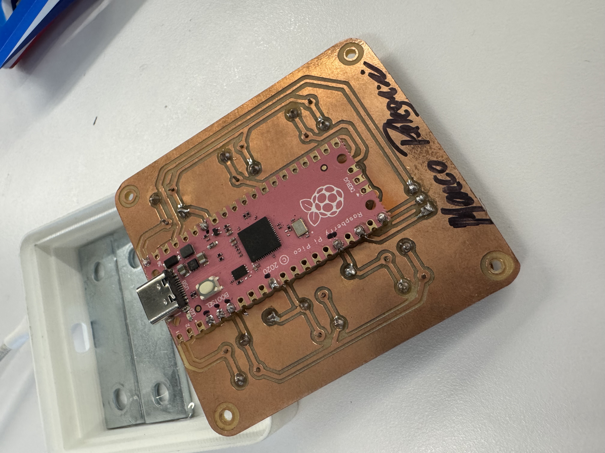

# Circuit Board

```
Single sided-board milled using a desktop CNC milling machine. The one I've used is discontinued, so I've liked the latest model

PCB design done using KiCad
```

- CNC (similar): [Bantam tools](https://store.bantamtools.com/products/bantam-tools-desktop-cnc-milling-machine)
- Software: [Kicad](https://www.kicad.org/)

KiCad files available in the KiCad folder

I opted for the cheapest setup giving this was going to be my first try.<br/>
I've used an RP2040 USB-C, but a more sophisticated board can be used, for bluetooth connectivity for instance.

The buttons are simple tactile switches I had laying around glued to the "keys" cut from the Façade (front plate).<br/>
You can definitelly do better with proper keyboard switches ([like this guy](https://kbd.news/Mask-keyboard-1819.html)), but I was going with what I had in hand.<br/>

Because I wasn't expecting to use more than one key at the time, I've used a simple matrix keyboard layout **without diodes**, but consider adding diodes in case you're creating combination of keys.<br/>
For instance, you can have multiple layers for even more functions and adding a combination of keys to switch between layers.

For RGB lights, I've used a few neopixels I had laying around. You can do better by using keyboard switches with embedded lights on them.


## Parts
- [Raspberry Pi Pico](https://www.raspberrypi.com/products/raspberry-pi-pico/)
- [Tactile switch](https://www.digikey.ca/en/products/detail/same-sky/TS02-66-60-BK-160-LCR-D/15634268)
- [LED Strip](https://www.adafruit.com/product/1138)



