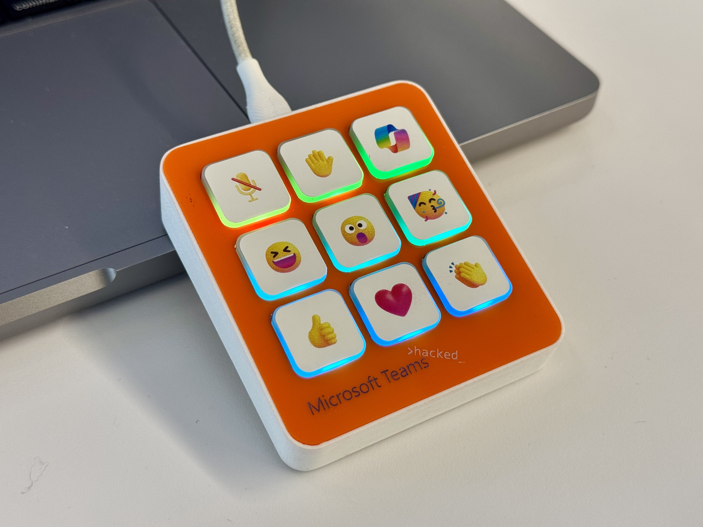

# Microsoft Teams Macropad

Microsoft Teams Macropad is a physical device, programmed specifically for Microsoft Teams with dedicated keys for triggering functionalities such as "mute" or "raise hand", as well as reactions to meetings and chats!

Documentation: https://pelegrini.ca/hardware/2024/11/10/marcopad/

These are all the asseets I've used to create the macropad. 

Feel free to fork, modify and suggest changes, as long as you keep everything free and never commercialize it.

> This required modifications to Microsoft Teams which are not publicly available yet. So be aware that to take the full advantage of this project you might need to wait until those changes makes into the public available version.  
> Functions that work out-of-the-box are Mute/Unmute and Haise/Lower hands  
> You can also program any of [Microsoft Teams Shortcuts](https://support.microsoft.com/en-us/office/keyboard-shortcuts-for-microsoft-teams-2e8e2a70-e8d8-4a19-949b-4c36dd5292d2) to the other keys instead of the reactions/Copilot ones

Each older in this repo has it's own documentation about each project component

Cheers

